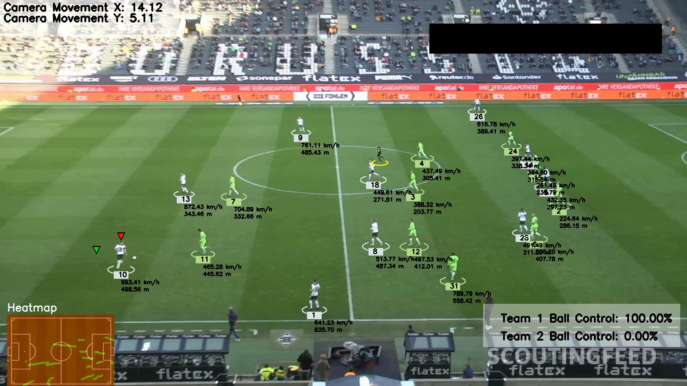

# ⚽ Football Analysis Detection

This repository contains a **football analysis system** that leverages **computer vision, machine learning, and deep learning** to track players, referees, and the ball in video footage. This system provides valuable insights for teams, analysts, and coaches to enhance performance and develop strategies.

## 🚀 Features
✅ **Object Detection and Tracking**: Utilizes **YOLO** and **ByteTrack** to detect and track players, referees, and the ball.  
✅ **Data Export**: Easily export tracking data for further analysis.  
✅ **Team Assignment**: Automatically assigns players to teams based on shirt colors using **KMeans clustering**.  
✅ **Camera Movement Estimation**: Tracks player movement despite camera shifts using **optical flow techniques**.  
✅ **Perspective Transformation**: Accurately measures player movement in meters by capturing scene depth.  
✅ **Speed & Distance Calculation**: Monitors player speed and total distance covered.  
✅ **Advanced Analysis**:  
   - Generates **heatmaps** to visualize player positions over time.  
   - Performs **zone coverage analysis** to assess player presence across different pitch zones.  

## 📷 Screenshot of the output video
  

## 🛠 Installation & Setup

1️⃣ **Clone the repository**  
   ```bash
   git clone https://github.com/your-username/football-analysis-detection.git
   cd football-analysis-detection
   ```
2️⃣ **Install dependencies**  
   ```bash
   pip install -r requirements.txt
   ```
3️⃣ **Run the main script**  
   ```bash
   python main.py --input_video path/to/video.mp4
   ```
4️⃣ **Output**: Processed video and analysis results will be saved in the `output/` folder.

---
*Developed with passion for football and data-driven insights!* ⚽🔥

